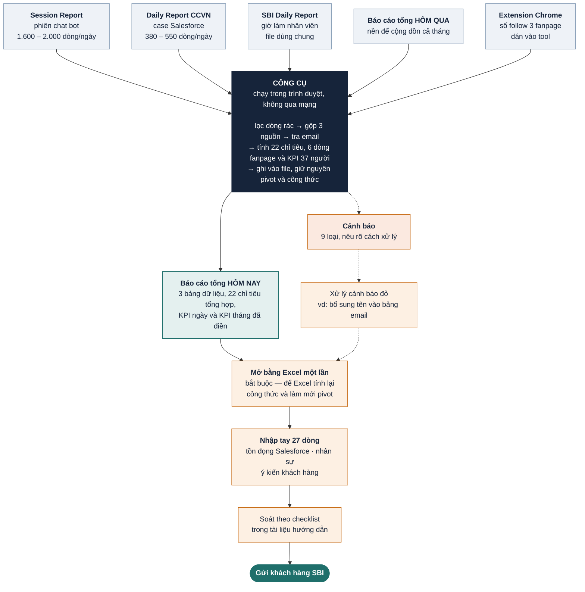

# Dự án tự động hoá Báo cáo ngày CCVN — Báo cáo tình trạng

*Cập nhật: 25/09/2026. Viết cho quản lý, không dùng thuật ngữ kỹ thuật.*
*Bản này thay thế báo cáo ngày 18/09.*

---

## Tóm tắt trong một phút

Công cụ làm báo cáo ngày cho khách hàng SBI **đã chạy được và đã kiểm chứng xong**.
So với báo cáo lần trước, ba thay đổi lớn:

1. **Kiểm chứng chặt hơn nhiều.** Lần trước kiểm trên một ngày. Lần này chạy thử
   **ba ngày liên tiếp** (13 → 14 → 15/9), mô phỏng đúng cách dùng thật: báo cáo
   hôm nay dựng trên file của hôm qua. Đã so **122.957 ô**.

2. **Phát hiện một lỗi nghiêm trọng suýt lọt ra khách hàng.** File xuất ra nhìn
   đúng trên mọi con số, nhưng khi mở bằng Excel thật thì **toàn bộ bảng KPI ngày
   ra số 0**. Đã tìm ra nguyên nhân và sửa. Chi tiết ở mục riêng bên dưới.

3. **Máy làm thay được nhiều hơn.** Bảng tổng hợp tăng từ 8 lên **22 chỉ tiêu**
   tự điền; bảng KPI tháng từ 29 lên **37 người**; sheet `Summarize` trước đây
   trắng gần hết thì nay tự có số.

**Trạng thái:** sẵn sàng dùng hằng ngày. Đã có tài liệu hướng dẫn cho người làm.

---

## Tình trạng từng phần

| Phần việc | Trạng thái | Ghi chú |
|---|---|---|
| Gộp và dán 3 bảng dữ liệu chính | Xong | Hơn 2.700 dòng mỗi ngày, không còn copy-paste tay |
| Bảng tổng hợp `Summarize_team VietNam` | 22 chỉ tiêu + 6 dòng fanpage | 27 dòng còn lại không có trong dữ liệu đầu vào |
| Sheet `Summarize` | Xong | Tự rút số từ bảng trên |
| Bảng KPI tháng | Xong | 37 người + dòng tổng team |
| Bảng KPI ngày | Xong | Tự tính lại toàn bộ chuỗi công thức |
| Ngày tháng ở đầu các tab | Xong | 6 vị trí |
| Cảnh báo dữ liệu bất thường | Xong | 9 loại cảnh báo |
| Số like/follow fanpage | Xong | Nối với extension Chrome lấy số follow |
| Tài liệu hướng dẫn người dùng | Xong | `HUONG-DAN-SU-DUNG.md` |
| Chạy thử trong công việc thật | **Chưa** | Đề xuất chạy song song 1 tuần |

---

## Luồng làm việc

Sơ đồ dưới đây cho thấy công cụ nằm ở đâu trong quy trình, và **chỗ nào con người
vẫn phải làm**. Nét liền là luồng chính; nét đứt là nhánh cảnh báo, chỉ xuất hiện
khi dữ liệu đầu vào có vấn đề.

**Đọc sơ đồ này nên chú ý ba điểm:**

1. **Ô xanh đậm là phần máy làm.** Toàn bộ việc gộp và dán hơn 2.700 dòng mỗi ngày
   nằm gọn trong đó — và đây cũng là phần dễ sai nhất của cách làm cũ.
2. **Bốn ô cam là phần người vẫn phải làm**, không bỏ được. Trong đó bước *"Mở bằng
   Excel một lần"* là bắt buộc: bỏ qua thì file giao đi sẽ thiếu số ở bảng KPI.
3. **Báo cáo hôm nay dựng trên file hôm qua.** Đây là lý do không thể tạo file mới
   từ đầu: số liệu cộng dồn cả tháng nằm trong chính file đó. Cũng vì vậy, nếu một
   ngày làm sai thì các ngày sau kế thừa cái sai — nên bước soát cuối rất quan trọng.

---

## Một lỗi nghiêm trọng suýt lọt

Đây là phần đáng chú ý nhất của giai đoạn này, và nó nói lên một điều quan trọng
về cách kiểm thử.

**Chuyện gì xảy ra:** file báo cáo tổng có một bộ lọc ẩn theo ngày. Bộ lọc này
được người dùng tick tay từng ngày một. Mỗi lần công cụ nạp dữ liệu của một ngày
mới vào, **ngày đó chưa có trong danh sách tick**, nên Excel coi như không được
chọn và **lọc sạch toàn bộ dữ liệu**.

**Hậu quả nếu không phát hiện:** bảng tổng hợp tự động rỗng, kéo theo toàn bộ bảng
**KPI ngày ra số 0** cho tất cả nhân viên. Báo cáo gửi khách hàng sẽ có một sheet
trắng trong khi mọi số liệu thô bên trong vẫn hoàn toàn đúng.

**Vì sao bộ kiểm tra tự động không bắt được:** nó so sánh từng ô dữ liệu, mà mọi
ô dữ liệu đều đúng. Lỗi chỉ hiện ra khi **mở file bằng Excel thật** và để Excel
tính lại.

**Bài học đã áp dụng:** từ nay mỗi lần kiểm chứng đều bắt buộc mở file bằng Excel
thật, và đã thêm một chốt chặn tự động để lỗi này không tái phát âm thầm.

> Đây cũng là lý do mục "Mở bằng Excel một lần trước khi gửi" được đưa vào tài
> liệu hướng dẫn như một bước bắt buộc.

---

## Đã làm thêm gì từ báo cáo lần trước

### Đối chiếu với quy trình nghiệp vụ

Bộ phận nghiệp vụ đã cung cấp bản mô tả quy trình 19 bước. Chúng tôi đối chiếu
từng bước với dữ liệu thật:

- **3 bước công cụ đang thiếu** đã được bổ sung: điền ngày ở đầu các tab, kéo công
  thức bảng phụ, và một quy tắc đổi tên người lập case.
- **2 chỗ bản mô tả ghi sai** đã đính chính và gửi lại: một cột được ghi là "bỏ
  đi" nhưng thực tế đang dùng, và một giá trị bị ghi sai chính tả.

Bản quy trình đã được viết lại đầy đủ, kèm bằng chứng cho từng chỗ sửa.

### Tự động hoá thêm

| Hạng mục | Trước | Nay |
|---|---|---|
| Chỉ tiêu bảng tổng hợp | 8 | **22** |
| Số người có KPI tháng | 29 | **37** |
| Sheet `Summarize` | Trắng gần hết | Tự điền |

Riêng khối **"Nội dung hỗ trợ"** (13 dòng) và **số lượng comment** trước đây gõ
tay, nay máy đếm tự động. Đã đối chiếu **39/39 ô khớp chính xác** trên cả ba ngày.

### Nối với extension lấy số fanpage

Bộ phận đã làm một extension Chrome tự đọc số **follow** của 3 fanpage (SBIR, SMILES,
DCOM). Công cụ nay nhận số đó: bấm **Copy** trong extension, dán vào ô trong tool, và
3 dòng follow được điền tự động.

Riêng số **like**, phía SBI xác nhận chỉ cần ước lượng theo các ngày trước. Đối chiếu
dữ liệu thật thì 3 số này **giữ nguyên suốt cả tháng** — tức người làm vẫn đang chép
lại của hôm trước. Công cụ làm đúng như vậy, và cảnh báo nếu giá trị vừa đổi.

Chính luật cảnh báo đó phát hiện ngay một lỗi: fanpage DCOM có số like là `311k` suốt
từ đầu tháng, nhưng từ ngày 14/9 bị gõ thành **`3111k`** — thừa một số 1, thành 3,1
triệu like cho một trang chỉ có 393 nghìn người theo dõi. Lỗi này đã lan sang ngày 15.

### Phát hiện thêm lỗi dữ liệu

Ngoài ba lỗi đã báo cáo lần trước, giai đoạn này tìm thêm bốn:

| Phát hiện | Ảnh hưởng |
|---|---|
| Bảng tra email thiếu một tên mới từ Salesforce | 18 case/ngày thiếu email, KPI người đó bằng 0 |
| Cột TEAM trong file nhân viên có 16 ô gõ nhầm ký tự | Rác lọt vào báo cáo gửi khách |
| File báo cáo của nhân viên thiếu 4–7 người mỗi ngày | Những người này bị KPI bằng 0 |
| Một nhân viên dùng định mức KPI khác mọi người | Nếu tính theo định mức chung sẽ sai gần 3 lần |
| Số like fanpage DCOM bị gõ thừa một chữ số | `3111k` thay vì `311k`, từ ngày 14/9 |

Công cụ nay **cảnh báo đích danh** từng trường hợp thay vì âm thầm cho ra số 0.

---

## Còn gì phải làm tay

Nói thẳng để tránh kỳ vọng sai: **công cụ chưa tự động hoá 100%, và không thể**,
vì những số dưới đây không nằm trong các nguồn dữ liệu mà công cụ đọc được.

| Nhóm | Số dòng | Nguồn thật |
|---|---|---|
| Tồn đọng Salesforce | 9 | 4 báo cáo Salesforce khác |
| Đăng ký mới | 3 | Báo cáo đăng ký |
| Ý kiến khách hàng | 6 | Đọc và phân loại tay |
| Nhân sự (Head Count) | 2 | Người quyết định |
| Chi tiết Outbound | 3 | Khi có phát sinh |
| Khung giờ, số OP, claim, Others | 4 | Số tự khai |

Công cụ **liệt kê đủ danh sách này mỗi lần chạy** để không ai quên.

Ba chỉ tiêu trong đó (Others, khung giờ, số lượng OP) chúng tôi **đã thử suy ra
từ dữ liệu nhưng không khớp**, và đã ghi lại lý do để lần sau khỏi mất công thử lại.

---

## Làm sao biết công cụ chạy đúng

### Chạy thử theo chuỗi ba ngày

Cách kiểm chứng mạnh nhất: lấy dữ liệu thật ba ngày liên tiếp, cho công cụ dựng
lại báo cáo ngày 14 từ file ngày 13, rồi ngày 15 từ file ngày 14 — đúng như cách
dùng thật — và so từng ô với bản mà team đã làm tay.

| Ngày | Số ô đã so |
|---|---|
| 13/9 | 35.837 |
| 14/9 | 42.166 |
| 15/9 | 44.954 |
| **Tổng** | **122.957** |

**Ngày 13/9 khớp tuyệt đối — không sai một ô nào trên cả 8 hạng mục kiểm tra.**

### Mở bằng Excel thật

Cả ba ngày đều được mở bằng Excel và kiểm tra:

- File mở bình thường, không báo hỏng
- Đủ 11 sheet, 4 bảng tổng hợp tự động, đúng như bản gốc
- Bảng tổng hợp tính ra đúng số dòng của từng ngày
- Bảng KPI ngày có số liệu, không còn bị rỗng
- Ngày tháng đúng ở cả 6 vị trí
- **Dữ liệu các ngày trước không bị đụng tới một ô nào**

---

## Những chỗ còn lệch và vì sao

Hai ngày 14 và 15 có tổng cộng **285 ô lệch trên 122.957 ô, tức 0,23%**.
**Toàn bộ 285 ô đều đã truy được nguyên nhân, và không ô nào do công cụ tính sai.**

| Nguyên nhân | Số ô | Giải thích |
|---|---|---|
| Trạng thái case thay đổi | 245 | Dữ liệu Salesforce được tải về **muộn hơn** lúc team chốt báo cáo, case đã chuyển trạng thái. Không tránh được. |
| File nhân viên bị sửa sau ngày chốt | 14 | File dùng chung, nhân viên sửa lại giờ làm sau khi báo cáo đã nộp |
| Bảng tra email thiếu tên mới | 18 | Đã có cảnh báo đỏ, người làm chỉ cần thêm một dòng |
| Dữ liệu khách hàng được ẩn danh khác đi | 5 | Không ảnh hưởng số liệu |
| Bản làm tay tự mâu thuẫn | 3 | Xem ngay dưới đây |

### Điểm cần lưu ý về chất lượng báo cáo làm tay

Trong lúc đối chiếu, chúng tôi thấy **chính các bản báo cáo làm tay cũng có sai sót
nhỏ** — không phải do ai cẩu thả, mà là chuyện tất yếu khi làm tay hàng nghìn dòng:

- Ngày 14/9, ô "VIBER" ghi **0** trong khi chính bảng dữ liệu của file đó có **3 dòng Viber**
- Ngày 14/9, ô "số khách hàng" ghi **1619**, số đếm thật là **1618**
- Ngày 15/9, quy tắc đổi tên người lập case chỉ áp dụng cho **23 trên 34 case** —
  làm đến giữa chừng rồi dừng

Công cụ làm nhất quán 100% nên những chỗ này hiện ra thành "lệch". **Đây là điểm
mạnh, không phải điểm yếu** — nhưng cần nói trước để khi đối chiếu không ai hiểu
nhầm là công cụ sai.

---

## An toàn dữ liệu

Không thay đổi so với báo cáo trước, nhưng nhắc lại vì đây là điều kiện bắt buộc
của dự án: dữ liệu xử lý có **thông tin cá nhân khách hàng** (họ tên, ngày sinh,
mã khách hàng, số điện thoại).

Công cụ được thiết kế để **không có đường nào cho dữ liệu rời khỏi máy**: chạy
hoàn toàn trong trình duyệt trên máy người dùng, không gửi gì lên mạng, không lưu
file lại, không cần tài khoản. Không có server nghĩa là không có chỗ nào để rò rỉ.

---

## Rủi ro còn lại

| Rủi ro | Mức độ | Đã chuẩn bị gì |
|---|---|---|
| Nguồn dữ liệu đổi định dạng cột | Trung bình | Mọi quy tắc nằm trong màn hình **Cấu hình**, sửa được không cần lập trình viên |
| File báo cáo tổng đổi cấu trúc | Trung bình | Có nút tự kiểm chứng, chạy là biết ngay chỗ lệch |
| Người dùng quên mở bằng Excel | **Cao** | Đã đưa vào hướng dẫn như bước bắt buộc; cần nhắc trong buổi đào tạo |
| Người dùng bỏ qua cảnh báo đỏ | **Cao** | Cảnh báo có màu và nêu rõ cách xử lý; nên yêu cầu xác nhận trong tuần đầu |
| Chưa chạy thử trong công việc thật | Trung bình | Đề xuất chạy song song 1 tuần |

Hai rủi ro cao đều thuộc về **thói quen người dùng**, không phải kỹ thuật. Cách
xử lý là đào tạo và giám sát tuần đầu, không phải sửa công cụ.

---

## Đề xuất

**Nên làm ngay:**

1. **Chạy song song một tuần** — người làm vẫn làm tay như cũ, đồng thời chạy công
   cụ và so hai bản. Hết tuần không có chênh lệch bất ngờ thì chuyển hẳn.
2. **Đào tạo 30 phút** cho người làm, nhấn hai điểm: bắt buộc mở bằng Excel, và
   không bỏ qua cảnh báo đỏ.
3. **Dọn bảng tra email** trong file báo cáo tổng: xoá tên trùng, bổ sung tên mới.

**Nên làm sớm:**

4. **Sửa định dạng cột ngày** trong file báo cáo của nhân viên, chấm dứt lỗi ghi
   sai ngày đã nêu ở báo cáo trước.
5. **Rà lại báo cáo các ngày 1–12** đã nộp, số liệu có thể đã thiếu.
6. **Thống nhất quy tắc đổi tên người lập case**, hiện mỗi ngày áp dụng một khác.

**Có thể cân nhắc về sau:**

7. Kết nối thêm 4 báo cáo Salesforce, tự động nốt 9 chỉ tiêu tồn đọng.
8. Cho công cụ ghi nhớ file báo cáo tổng, mỗi ngày chỉ cần kéo 3 file.

---

## Kết luận

Giai đoạn này không thêm nhiều tính năng mới, mà chủ yếu là **kiểm chứng cho chắc**
và **sửa những chỗ sai mà lần kiểm tra đầu không nhìn thấy**.

Kết quả đáng giá nhất là lỗi bảng KPI ra số 0: một lỗi mà mọi con số đều đúng
nhưng file giao ra thì hỏng. Nếu không mở bằng Excel thật để kiểm tra, nó đã đi
thẳng ra khách hàng.

Công cụ hiện đã sẵn sàng dùng hằng ngày. Việc còn lại chủ yếu là **tổ chức**:
chạy song song một tuần, đào tạo người dùng, và dọn lại vài chỗ trong dữ liệu nguồn.

---

## Tài liệu liên quan

| File | Dành cho ai |
|---|---|
| `HUONG-DAN-SU-DUNG.md` | Nhân viên làm báo cáo hằng ngày |
| `flow.md` | Quy trình nghiệp vụ 19 bước đã đối chiếu và đính chính |
| `tool/README.md` | Tài liệu kỹ thuật, dành cho người bảo trì công cụ |
